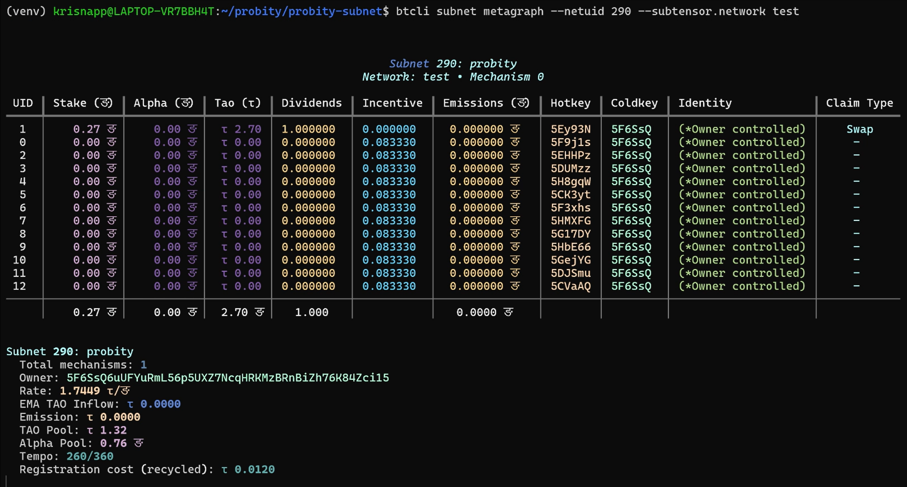
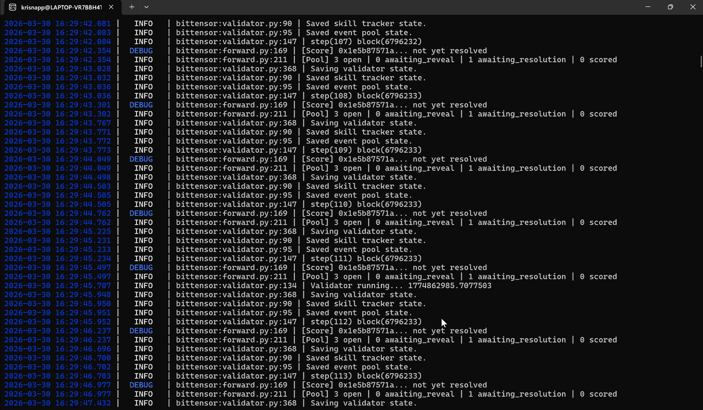
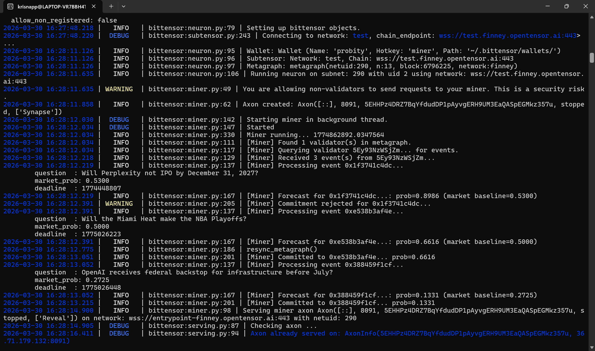
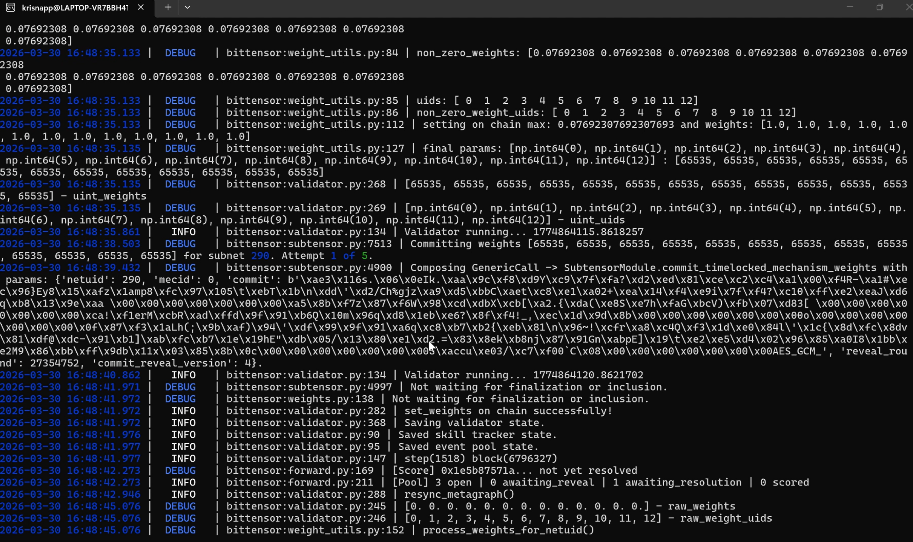
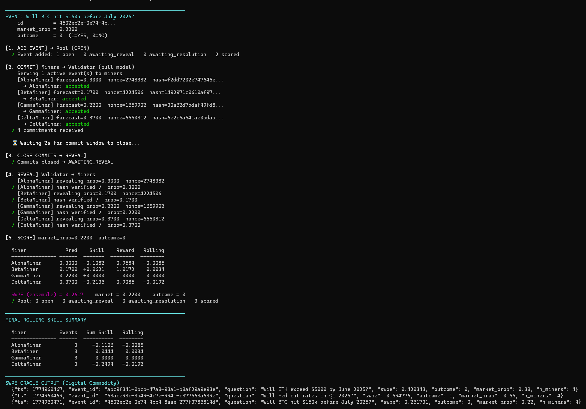

# Probity — Skill-Weighted Probability Ensemble Subnet

**Bittensor Subnet 290 (Testnet) | Ideathon Round II**

Probity is a decentralized superforecaster network built on Bittensor. It produces a **Skill-Weighted Probability Ensemble (SWPE)** — a calibration-weighted consensus probability that consistently outperforms raw market prices.

Emission flows exclusively to persistent probabilistic outperformance versus market consensus. There are no heuristic penalties, no categorical tiers, no manual adjustments. The system is fully deterministic and auditable.

---

## Testnet Deployment Evidence

Probity is live on Bittensor testnet (netuid 290) with 10 miners and 3 validators.

### Metagraph — 13 Registered Nodes



### Validator Logs — Event Ingestion, Forward Pass, State Persistence



### Miner Logs — Pull Events, Compute Forecast, Submit Commitment Hash



### set_weights — On-Chain Weight Submission



### Incentive Mechanism — Scoring Pipeline Output



The screenshot above shows the **production scoring pipeline** (`template/validator/reward.py`) running end-to-end via `scripts/demo_flow.py`. This is not a separate implementation — it imports and executes the exact same `RollingSkillTracker`, `compute_skill()`, `compute_swpe()`, `get_rewards()`, and `EventPool` used by the live validator.

The only difference from the live testnet is the input: real Polymarket events require 48+ hours to complete the full commit-reveal-resolve cycle, so the demo uses simulated event outcomes to demonstrate the scoring behavior in seconds. The math and code path are identical.

Key observations:
- **BetaMiner** (accurate forecaster) earns positive rolling skill (+0.0034) and the highest weight
- **DeltaMiner** (poor forecaster) earns negative rolling skill (-0.0192) and the lowest weight
- **GammaMiner** (mirrors market exactly) earns zero skill — confirming that copying the market yields no reward
- SWPE ensemble output is closer to the true outcome than the raw market price

This is reproducible — run `PYTHONPATH=. python scripts/demo_flow.py` to verify.

---

## Table of Contents

- [Testnet Deployment Evidence](#testnet-deployment-evidence)
- [How It Works](#how-it-works)
- [Architecture](#architecture)
- [Setup Instructions](#setup-instructions)
- [Running the Validator](#running-the-validator)
- [Running the Miner](#running-the-miner)
- [Dashboard & API](#dashboard--api)
- [Running Tests](#running-tests)
- [Demo (No Network Required)](#demo-no-network-required)
- [Configuration](#configuration)
- [Project Structure](#project-structure)
- [Core Formulas](#core-formulas)

---

## How It Works

1. **Validator** fetches live binary prediction markets from [Polymarket](https://polymarket.com) and adds them to an event pool.
2. **Miners** query the validator for active events (pull-based protocol), compute a probability forecast, and submit a SHA-256 commitment hash.
3. After the 48-hour commit window closes, the **validator** requests reveals from miners and cryptographically verifies each hash.
4. When the market resolves (requiring agreement from both CLOB and Gamma APIs), the validator scores miners using **log-loss** relative to the market baseline.
5. Per-miner **RollingSkill** is updated with a Bayesian prior, and exponential weights are submitted to the Bittensor metagraph on-chain.
6. The **SWPE oracle** — the subnet's digital commodity — is computed and persisted.

### Event Lifecycle

```
OPEN → AWAITING_REVEAL → AWAITING_RESOLUTION → SCORED
```

### Commit-Reveal Protocol

Miners submit: `SHA-256(probability + nonce + event_id + miner_hotkey)`

This cryptographically locks each forecast. No miner can see or copy another's prediction during the commit window. Late or invalid reveals are ignored.

---

## Architecture

### Pull-Based Model

Unlike traditional push-based subnets, Probity uses a **pull model**: miners actively query the validator's axon for events and submit commitments. The only push direction is the validator sending `Reveal` requests after the commit window closes.

```
Miner ──EventList──▶ Validator        (pull: "what events are active?")
Miner ──CommitSubmission──▶ Validator  (push commitment hash)
Validator ──Reveal──▶ Miner            (push: "reveal your forecast")
```

### Synapse Definitions

| Synapse | Direction | Purpose |
|---------|-----------|---------|
| `EventList` | Miner → Validator | Query active events |
| `CommitSubmission` | Miner → Validator | Submit commitment hash |
| `Reveal` | Validator → Miner | Request forecast reveal |

---

## Setup Instructions

### Prerequisites

- Python 3.10+
- [Bittensor SDK](https://github.com/opentensor/bittensor) (`pip install bittensor`)
- Bittensor CLI (`btcli`)
- A registered wallet on testnet (netuid 290)

### Installation

```bash
git clone https://github.com/krisnaapps/probity-subnet.git
cd probity-subnet
python3 -m venv venv
source venv/bin/activate
pip install -e .
```

### Register on Testnet

```bash
# Create wallet
btcli wallet create --wallet.name probity

# Register validator hotkey
btcli subnets register --netuid 290 --subtensor.network test \
  --wallet.name probity --wallet.hotkey validator

# Register miner hotkey
btcli subnets register --netuid 290 --subtensor.network test \
  --wallet.name probity --wallet.hotkey miner
```

---

## Running the Validator

```bash
python3 neurons/validator.py \
  --netuid 290 \
  --subtensor.network test \
  --wallet.name probity \
  --wallet.hotkey validator \
  --logging.debug
```

The validator will:
- Fetch live events from Polymarket every 6 hours
- Accept miner commitments via its axon
- Close commits after 48-hour deadline
- Send Reveal requests to committed miners
- Score resolved events using log-loss
- Update RollingSkill and set weights on-chain
- Persist all state (event pool, skill tracker) to disk

---

## Running the Miner

```bash
python3 neurons/miner.py \
  --netuid 290 \
  --subtensor.network test \
  --wallet.name probity \
  --wallet.hotkey miner \
  --logging.debug
```

Add `--local` when running miner and validator on the same machine (overrides validator IP to localhost).

The miner will:
- Query validators for active events every 60 seconds
- Compute a probability forecast for each new event
- Submit a commitment hash (SHA-256)
- Respond to Reveal requests with the original probability and nonce

### Implementing Your Forecasting Model

The default miner uses a random forecast. To implement your own model, edit `neurons/miner.py` in the `pull_and_submit` method — look for the `TODO` section:

```python
# Replace this with your model:
prob = your_model.predict(event.question, event.market_prob)
```

Possible approaches: LLM-based reasoning, Bayesian models, statistical ensembles, market-derived signals, or agentic pipelines.

---

## Dashboard & API

Probity includes a professional dashboard and REST API for visualizing the SWPE oracle output.

### Quick Start (with demo data)

```bash
# Generate demo data
PYTHONPATH=. python scripts/generate_demo_data.py --output-dir /tmp/probity

# Launch dashboard
PYTHONPATH=. python scripts/dashboard.py --data-dir /tmp/probity
```

Open http://localhost:8080 in your browser.

### API Endpoints

| Endpoint | Description |
|----------|-------------|
| `GET /` | Dashboard UI |
| `GET /api/oracle` | SWPE oracle records (JSON) |
| `GET /api/leaderboard` | Miner skill rankings (JSON) |
| `GET /api/status` | Subnet health summary (JSON) |

### Using Live Validator Data

Point the dashboard at your validator's data directory:

```bash
PYTHONPATH=. python scripts/dashboard.py \
  --data-dir ~/.bittensor/miners/probity/validator/netuid290/validator
```

---

## Running Tests

```bash
pytest tests/ -v
```

The test suite covers:
- Full pull-model flow (commit → reveal → hash verify → score)
- Commitment rejection after deadline
- EventList filtering (only OPEN events served)
- Rolling skill tracker updates
- Deadline enforcement (no premature reveals)
- Mock infrastructure (subtensor, metagraph, dendrite)
- Edge cases (no events, no miners committed)

---

## Demo (No Network Required)

Run the full commit-reveal-score-SWPE pipeline locally with live Polymarket events:

```bash
PYTHONPATH=. python scripts/demo_flow.py
```

This runs entirely in-process using the real validator scoring code, event pool, rolling skill tracker, and SWPE computation. No wallet, no network connection required (except for fetching live events from Polymarket).

---

## Configuration

| Flag | Default | Description |
|------|---------|-------------|
| `--netuid` | — | Subnet UID (290 on testnet) |
| `--subtensor.network` | — | Network (`test`, `finney`, `local`) |
| `--wallet.name` | — | Coldkey wallet name |
| `--wallet.hotkey` | — | Hotkey name |
| `--logging.debug` | off | Enable debug-level logging |
| `--local` | off | Miner: override validator IP to localhost |
| `--probity.beta` | 5.0 | Exponential weighting temperature |
| `--probity.N0` | 10.0 | Bayesian prior count for RollingSkill |
| `--probity.commit_window` | 172800 | Commit window in seconds (48 hours) |

---

## Project Structure

```
probity-subnet/
├── neurons/
│   ├── miner.py                 # Miner neuron — pull-based commit-reveal
│   └── validator.py             # Validator neuron — scoring and weight setting
├── template/
│   ├── protocol.py              # Synapse definitions (EventList, CommitSubmission, Reveal)
│   ├── mock.py                  # Mock infrastructure for testing
│   ├── base/                    # Base neuron classes (from Bittensor template)
│   │   ├── neuron.py
│   │   ├── miner.py
│   │   └── validator.py
│   ├── validator/
│   │   ├── forward.py           # Core forward loop (fetch, close, reveal, score, SWPE)
│   │   ├── reward.py            # Log-loss, RollingSkillTracker, SWPE computation
│   │   ├── event_pool.py        # Event lifecycle management with persistence
│   │   ├── event_source.py      # Polymarket Gamma + CLOB API integration
│   │   └── event_resolver.py    # Dual-source market resolution detection
│   └── utils/                   # Configuration and utility functions
├── scripts/
│   ├── demo_flow.py             # Full flow demo (no network required)
│   ├── dashboard.py             # FastAPI dashboard + REST API
│   ├── generate_demo_data.py    # Generate realistic demo data
│   └── ProbityLogo.png          # Probity logo
├── tests/
│   ├── test_flow.py             # End-to-end pull model flow tests
│   ├── test_forward_real.py     # Forward pass integration tests
│   └── test_mock.py             # Mock infrastructure tests
├── requirements.txt
├── setup.py
└── LICENSE
```

---

## Core Formulas

### Log-Loss Scoring

```
LL(p, y) = -(y * log(p) + (1-y) * log(1-p))
```

### Relative Skill vs Market Baseline

```
Skill_i = LL_market - LL_miner
```

Positive skill = miner beat the market. Mirroring or random guessing yields zero expected skill.

### Rolling Skill (Bayesian Smoothing)

```
RollingSkill_i = sum_skill_i / (N0 + count_i)
```

Where N0 = 10 (Bayesian prior count). New miners start near zero and converge to their true average.

### Exponential Weight Routing

```
w_i = exp(β × RollingSkill_i)      β = 5.0
ŵ_i = w_i / Σ_j w_j               (normalized for chain)
```

### SWPE (Skill-Weighted Probability Ensemble)

```
SWPE = Σ(w_i × p_i) / Σ(w_i)
```

The digital commodity output — a calibration-weighted consensus probability.

### Dual-Source Resolution

Events are only marked as resolved when **both** the Polymarket CLOB API and Gamma API agree on the outcome. Disputed resolutions are excluded.

---

## Anti-Gaming Properties

- **Commit-reveal** prevents real-time copying of forecasts
- **Relative benchmarking** neutralizes market mirroring (zero expected skill)
- **Rolling evaluation** mitigates short-term luck
- **Exponential weighting** creates continuous incentive surface
- **Sybil resistance** — splitting identity does not increase aggregate weight

Manipulation without genuine informational advantage is mathematically unprofitable.

---

## License

MIT License — see [LICENSE](LICENSE)
